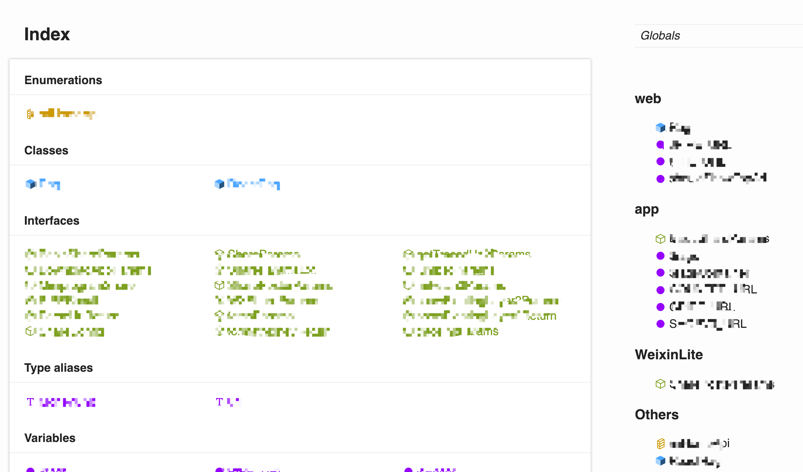

# typedoc-plugin-toc-group

A plugin for [TypeDoc](https://github.com/TypeStrong/typedoc) that generate a menu for toc content list.

It can help you group your api list by `@platform`、`@kind`、`@group`. Just put the keywords to you code content then it will be ok when TypeDoc build over.

## Installation

```
npm install --save-dev typedoc-plugin-toc-group
```

## What does it look like?



## Something else...

I have made a little change in [typedoc-default-themes](https://github.com/tangkunyin/typedoc-default-themes)

In order to show a bigger group title to users, you'd better install this theme first.
